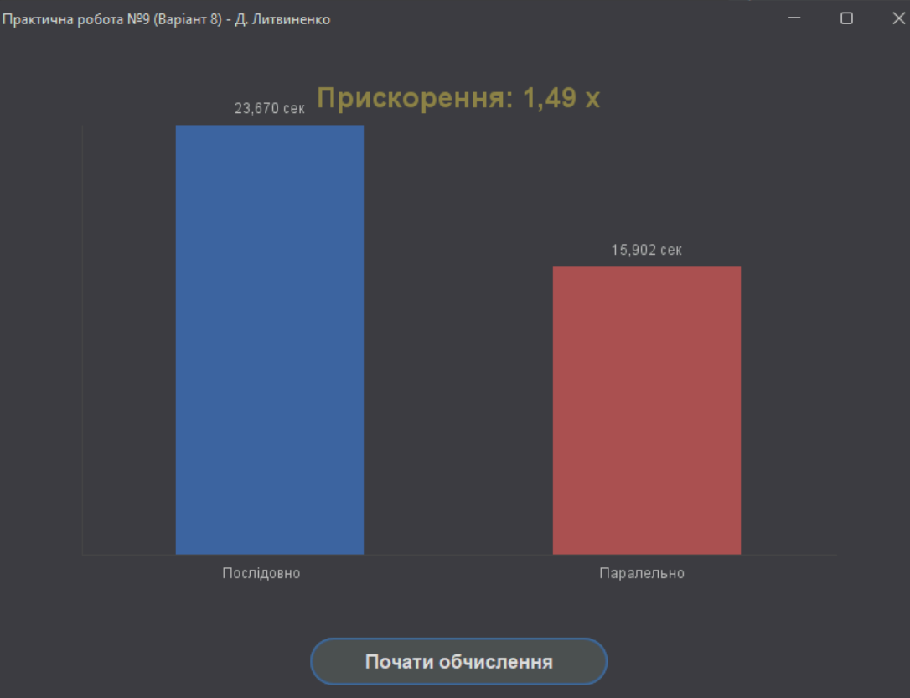

# Практична робота №9: Паралельні обчислення (Modern GUI)

Проєкт для виконання практичної роботи №9 з паралельних обчислень (Варіант 8) на Java.

Мета виходить за рамки простої консольної програми і полягає у створенні повноцінного десктопного додатку з сучасним GUI, візуалізацією та пакуванням у `.exe`, який запускається без встановленої Java.

---

## 📖 Академічне завдання (Варіант 8)

> **Мета та завдання роботи:** вироблення навичок реалізації обчислювальних алгоритмів з використанням засобів багатопотокового програмування.
>
> **Вказівки до роботи:** У кожному варіанті потрібно написати багатопотокову версію програми... та виміряти її прискорення на кількох тестових прикладах.
>
> **Варіант 8:** Задана квадратна числова матриця А. Назвемо порядком елемента кількість відмінних від нуля елементів, які розташовані на діагоналях матриці, на перетині яких міститься цей елемент. Написати паралельну програму для знаходження суми елементів найбільшого порядку.

📸 Скріншот
Ось так виглядає фінальний додаток.


---

## 🚀 Фінальний результат

* `ModernLab.exe` всередині `.zip` архіву.
* Додаток використовує Java Swing з кастомною темою `FlatLaf` (темний режим).
* Обчислення виконуються асинхронно у `SwingWorker`, не "вішаючи" GUI.
* Результат (прискорення) візуалізується на власному графіку `ChartPanel`, намальованому через `Graphics2D`.
* Проєкт оптимізовано по пам'яті для уникнення `OutOfMemoryError` при роботі з великими матрицями (`N=20000`).

---

## 📂 Структура проєкту

* `MainApp.java`: Головний клас GUI.
* `MatrixLabLogic.java`: Ядро обчислень (Варіант 8).
* `ChartPanel.java`: Кастомний компонент `JPanel` для графіка.
* `flatlaf-3.6.2.jar`: **(Залежність)** Бібліотека GUI.
* `ModernApp.jar`: **(Збірка)** "Тонкий" JAR, створений через VS Code.

---

## 🛠️ Шлях збірки (Кроки 1-6)

### Крок 1-4: Код та Оптимізація

Ми написали та налагодили код у файлах `MainApp.java`, `MatrixLabLogic.java` та `ChartPanel.java`.

#### Як запустити (для розробки)

1.  **Скомпілювати (3 файли):**
    ```bash
    javac -cp ".;flatlaf-3.6.2.jar" MainApp.java MatrixLabLogic.java ChartPanel.java
    ```
2.  **Запустити (з прапорцем для Java 17+):**
    ```bash
    java -cp ".;flatlaf-3.6.2.jar" --enable-native-access=ALL-UNNAMED MainApp
    ```

---

### Крок 5: Створення "Thin-JAR"

На цьому кроці ми створюємо `.jar` файл, який містить *тільки наш код*.

1.  У VS Code натисніть `F1` (або `Ctrl+Shift+P`) і виберіть **"Java: Export Jar..."**.
2.  Виберіть 3 файли класів: `MainApp.class`, `MatrixLabLogic.class` та `ChartPanel.class`.
3.  Коли він запитає "Main Class", виберіть `MainApp`.
4.  Збережіть файл з назвою **`ModernApp.jar`**.

**Важливо:** `ModernApp.jar`, створений таким чином, **не** містить `flatlaf`. Це нормально.

---

### Крок 6: Створення .exe (jpackage)

Тепер ми вкажемо `jpackage` взяти **обидва** файли (`ModernApp.jar` та `flatlaf-3.6.2.jar`) і запакувати їх.

#### Фінальна команда `jpackage`:

Ця команда використовує `--class-path`, щоб включити вашу `flatlaf` залежність.

```bash
jpackage --type app-image --input . --name "ModernLab" --main-jar "ModernApp.jar" --main-class "MainApp" --class-path "flatlaf-3.6.2.jar" --java-options "--enable-native-access=ALL-UNNAMED"
